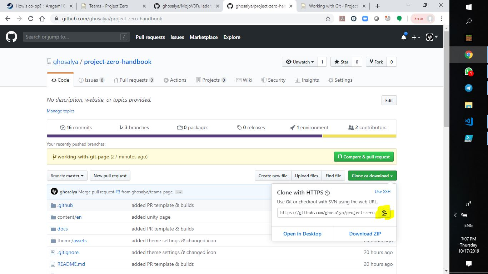

# Working with Git

You can see [the simple guide - no deep shit! - git](https://rogerdudler.github.io/git-guide/) to get started!

## Git Bash FAQ

### _How do I download the repo?_

```
$ git clone <repo-url>
```

<details><summary>You can get the repo-url on the website (click to see image)</summary>
<p>



</p>
</details>

### _What's a branch?_

A branch is a "version" of the code that's available in the git repo. Usually, you want to work on your own branch, so that you dont delete/overwrite other people's changes.

We usually want to make a branch out of master, so to make a branch, you can do
```
$ git checkout master
$ git checkout -b <branch-name>
```

Tips: try to make your branch name descriptive of what you want to do, e.g. `add-player-wasd-movement`